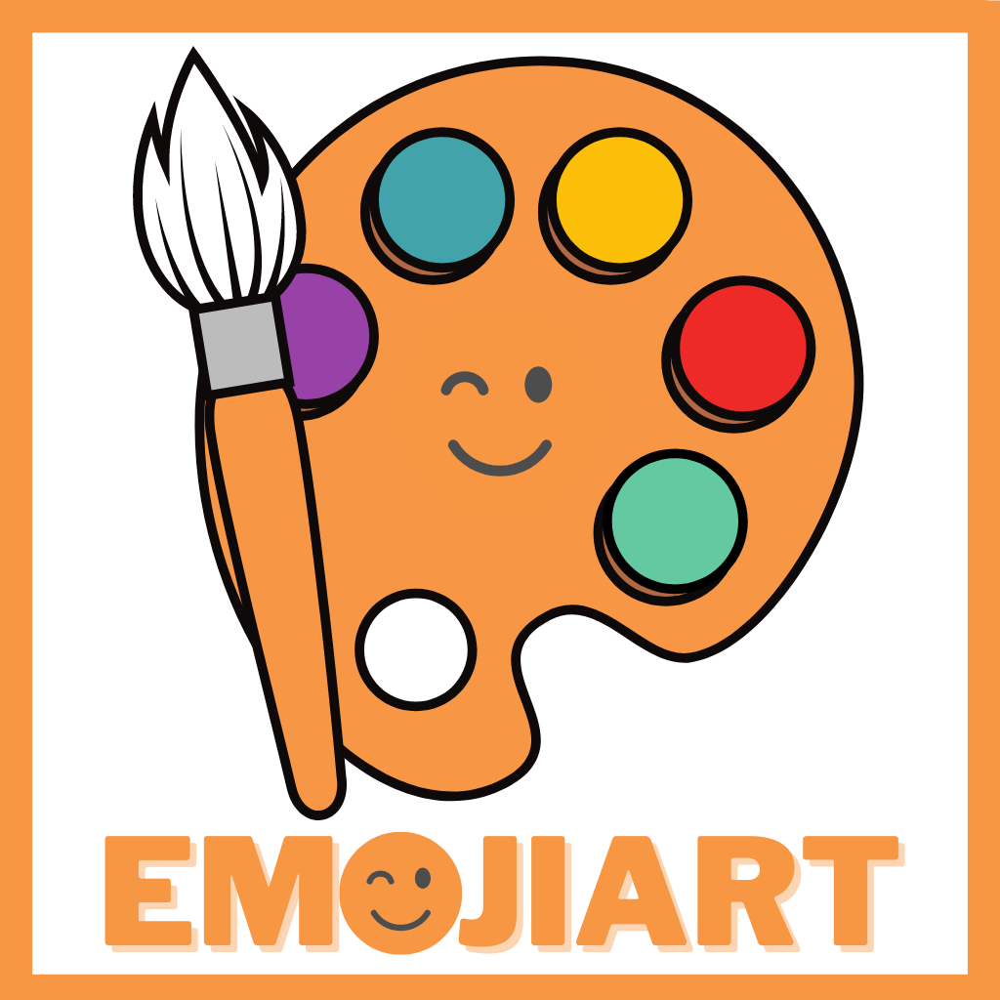

# Stanford-2023 - EmojiArt
App developed following Stanford University's course CS193p (Developing Applications for iOS using SwiftUI) - https://cs193p.sites.stanford.edu/2023

With this app you can drag images from other apps (ie: Safari, Photos) and use them as the background of the app's canvas, where you can drop emojis available in the app as palettes.

## This app features 
- App scene as DocumentGroup instead of WindowGroup, to work with document management
- GeometryReader to set the center of the view as X: 0, Y: 0
- Transferable protocol to drag content & Drop it into other content
- Async load of the images dragged from other apps (a URL is passed and converted to a UIImage)
- Gestures to zoom, pan and fit contents of View
- Button to change palette of emojis or to open a ContextMenu
- ContextMenu to add, remove, edit, explore or select palettes of emojis
- Sheet to edit any palette of emojis
- Sheet to select multiple palettes of emojis from a list, this list utilizes a NavigationStack to present each emoji individually
- The canva is saved as a custom document (.emojiart UTType) automatically with several user intents
- NotificationCenter observes changes in palettes and updates all the open windows of the app
- Sturldata: Type that implements Transferable protocol by proxy to String, Url and Data
- MVVM for the whole app (EmojiArt: background image and view components)
- MVVM for emoji collections (Palette)
- Custom App Icon made with Canva

**Extensions**
- String, to add each unique character into an array of Strings
- String, to remove a character if it matches the parameter passed
- Character, to check if a character is an Emoji
- CGRect, to find its center
- CGSize (typealiased as CGOffset), to facilitate working with operators (+, +=)
- UserDefaults, to get and set palettes managed by the user
- UTType, to work with DocumentGroup and implement protocol ReferenceFileDocument

**Components**
- AnimatedactionButton: Button with its actions animated
- UndoButton: Button able to redo & undo user actions with undoManager
- PaletteManager: A NavigationSplitView to manage all the palettes of all the themes, needs to be uncommented to see how it works

## Color Reference

| Color             | Hex                                                                |
| ----------------- | ------------------------------------------------------------------ |
| Accent Color |  #F79744 |

## License

 [MIT](https://choosealicense.com/licenses/mit/) 

## Screenshots

    
    
    
    

 

    
    
    
    

 
